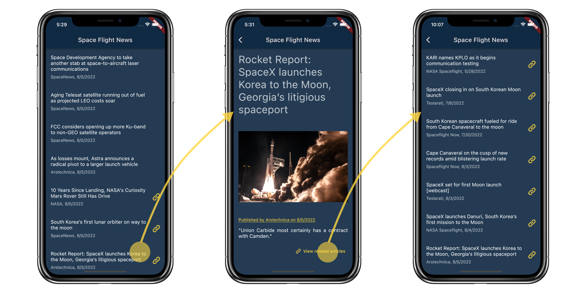

# Code generation for productive Dart and Flutter development

Source code of the mobile application that displays a list of recent spaceflight-related news obtained from [Spaceflight News API](https://thespacedevs.com/snapi). 

This application is implemented twice: [without code generation](space_flight_news_without_code_gen/) and [with code generation](space_flight_news_with_code_gen/). The goal of this project is to demonstrate the usage of various code-generating packages and some maintenance best practices.
